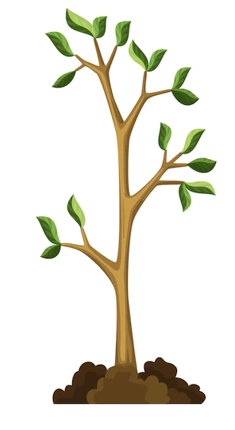

# 기본 구문

## 제목(Headings)

# 제목 1
## 제목 2
### 제목 3
#### 제목 4
##### 제목 5

## 단락 (Paragraphs)


첫 번째 문장 맨 끝에 띄어쓰기 두 번을 입력하세요.  
두 번째 문장입니다.

HTML 태그를 맨 뒤에 추가해주세요.<br>
두 번째 문장입니다.

## 굵게(bold) / 이탤릭체(Italic)

나는 **사과**를 좋아합니다.  

고양이가 *야옹*하고 울었다.  

매우 ***중요한*** 글자를 강조  

## 인용구(Blockquotes)

> 간단한 인용구를 사용할 땐 이렇게 사용합니다.

> 여러 단락을 사용하려면?
> 
> 이렇게 중간 라인에 >만 추가해주면 됩니다.
>
> 마지막 단락입니다.

> 중첩으로 인용구를 사용하려면?
>
>> 이렇게 >을 두 번 사용하면 들여쓰기가 됩니다.

> #### 다른 구문과 같이 쓰면 어떻게 될까요?
> *이탤릭*
> - 사과
> - 배

## 정렬된 목록(Ordered Lists)

1. 첫 번째
2. 두 번째
3. 세 번째  
--- 
1. 첫 번째
8. 두 번째
3. 세 번째
5. 네 번째
---
1. 첫 번째
2. 두 번째
	1. 두 번째 중에 첫 번째
	2. 두 번째 중에  두 번째
3. 세 번째

- 첫 번째
- 두 번째
- 세 번째

## 정렬되지 않은 목록(Unordered List)
* 첫 번째
* 두 번째
* 세 번째
- 첫 번째
- 두 번째
	- 두 번째 중에 첫 번째
	- 두 번째 중에 두 번째
- 세 번째

## 이미지(Images)
1. 이미지의 경로를 확인하세요.
2. 나무 사진을 붙여넣어 볼까요?  
    

이미지에 링크를 연결해볼까요?
[](https://en.wikipedia.org/wiki/Shiprock)

## 코드 (Codes)
코드 스타일을 적용하고 싶은 곳에 `백틱`을 사용하세요.  

## 수평선(Horizontal Rules)

수평선을 그리기 전에 줄바꿈을 반드시 해주세요

---

…수평선 아래에 있는 문장입니다.

***

abcde

__________________

fghijklm


## 링크(Links) / URL / Email

무언 갈 검색할 때는 [구글](www.google.co.kr)을 이용해보세요.  
https://www.naver.com  
fake@example.com  

## HTML 지원

마크다운을 지원하는 <strong>프로그램</strong>은 대부분 <em>HTML</em>을 지원합니다.  
**마크다운**과 *HTML*을 같이 사용하면 어떻게 될까요?

<image src="images/tree.png" height="120px" alt="나무1"/>

<br><br><br><br>

# 확장된 구문

## 테이블

| 구문 | 설명 |
| --- | ----------- |
| 헤더 | abababababab |
| 단락 | cdcdcdcdcdcd |
| 링크 | [링크1](www.google.co.kr), [링크2](www.naver.com) |

---

| 왼쪽정렬 | 가운데정렬 | 오른쪽 정렬 |
| :--- | :----: | ---: |
| 헤더 | 제목 | 아무 텍스트 |
| 단락 | 텍스트 | 또다른 텍스트 |


## 코드 블록(Code Blocks with Syntax Highlighting)

```json
{
	"성": "홍",
	"이름": "길동"
}
```
```bash
cd /project
ls -al
./script.sh
```
```html
<html>
	<head><title>Example</title></head>
	<body><h1>Title</h1></body>
</html>
```

## 각주(Footnotes)

여기 간단한 각주[^1]입니다. 그리고 여기 각주에 대한 설명[^2]입니다.

<br><br><br><br><br>

[^1]: 본문에 대하는 참조 문헌이나 본문의 낱말, 문장 등의 뜻을 알기 쉽게 풀이하는 덧붙이는 글  
[^2]: 각주는 논문을 쓸 때 본문의 어떤 부분의 뜻을 보충하거나 논문 본문의 아래쪽에 따로 단 주석을 말한다. 각주는 본문에서 숫자 또는 기호로 식별하며, 연구 논문에서 일반적으로 각주를 추가하여 본문에서 서술한 사실이나 인용문의 출처를 인용하는 데 사용된다.
